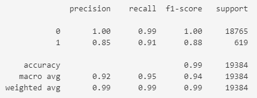
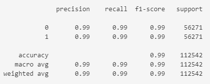

# credit-risk-classification
## Overview of the Analysis

* The purpose of the analysis is to predict and categorize credit risk using supervised machine learning models.
* The dataset is historical lending activity from a peer-to-peer lending services company and includes the following details:
  * loan_size
  * interest_rate
  * borrower_income
  * debt_to_income
  * num_of_accounts
  * derogatory_marks
  * total_debt
  * loan_status
* To predict each data point receives a probably of being in the healthy category and in this case it is where “loan status” is 1.
* The labels set (`y`) is the “loan_status” column where a value of 0 means that the loan is healthy and a value of 1 has a high risk of defaulting.
* The features set (`X`) are the remaining columns.
* To check the balance of label’s variable (`y`), the `value_counts` function was used.
* Using logistic regression model the following stages of machine learning process was used as part of the analysis.
  * Preprocess: Create label sets and clean the data by using train_test_split function
  * Train: Teach the model to recognize classification patterns with the large subset by using the fit function using the train variables.
  * Validate: Use the smaller subset to test how well the model can predict.
  * Predict: Using the testing variables, the model predicts labels for unclassified data.
  * Evaluate: Using the scoring features we can reveal the accuracy of the prediction

## Results

Description of the balanced accuracy scores and the precision and recall scores of all machine learning models.

* Machine Learning Model 1:
  * Logistic Regression Model with the original data.
    * The balance accuracy score of this model is 95.2% which tells us that the logistic regression model is doing a good job of predicting healthy loans.
    * The precision for healthy loans is 100% and high-risk loans is 85%, predicting positive observations which indicate low to no false positives.
    * The recall for healthy loans is 99% and high-risk loans is 91%, predicting positive observations for the classes which indicates a more comprehensive output and a low false negative rate.

* Machine Learning Model 2:
  * Logistic Regression Model with the original data.
    * The balance accuracy score of this model is 99.5% which tells us that the logistic regression model is doing a better job than Model 1 of predicting healthy loans.
    * The precision for healthy loans is 99% and high-risk loans is 99%, predicting positive observations which indicates low to no false positives.
    * The recall for healthy loans is 99% and high-risk loans is 99%, predicting positive observations for the classes which indicates a more comprehensive output and a low false negative rate.

## Summary

* Both models had a high accuracy but model 2 Logistic Regression with oversampled data is higher, therefore performing better.
* In this analysis, performance does not depend on solving problems. In both cases the healthy load and high-risk loans have a precision and recall that are high and acceptable.  Depending on the industry or what the specific problem we're solving, a higher tolerance may be needed, and performance will be dependent. 

***
***

## Module 20 Challenge
### Split the Data into Training and Testing Sets
---
* Read the lending_data.csv data from the Resources folder into a Pandas DataFrame
* Create the labels set (y) from the “loan_status” column, and then create the features (X) DataFrame from the remaining columns
* Split the data into training and testing datasets by using train_test_split. 

### Create a Logistic Regression Model 
---
* Fit a logistic regression model by using the training data (X_train and y_train).
* Save the predictions on the testing data labels by using the testing feature data (X_test) and the fitted model.
* Evaluate the model’s performance by doing the following:
    * Generate a confusion matrix. 
    * Generate a classification report.
    * nswer the following question: How well does the logistic regression model predict both the 0 (healthy loan) and 1 (high-risk loan) labels?

### Write a Credit Risk Analysis Report
---
* Provide an overview that explains the purpose of this analysis.
* Using a bulleted list, describe the accuracy, precision, and recall scores of the machine learning model.
* Summarize the results from the machine learning model. Include your justification for recommending the model for use by the company. If you don’t recommend the model, justify your reasoning. 

### Coding Conventions and Formatting
---
* Place imports at the top of the file, just after any module comments and docstrings and before module globals and constants.
* Name functions and variables with lowercase characters, with words separated by underscores. 
* Follow DRY (Don’t Repeat Yourself) principles, creating maintainable and reusable code.
* Use concise logic and creative engineering where possible. 

### Code Comments
---
* Be well commented with concise, relevant notes that other developers can understand.